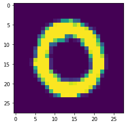
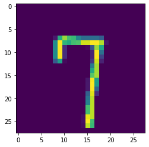
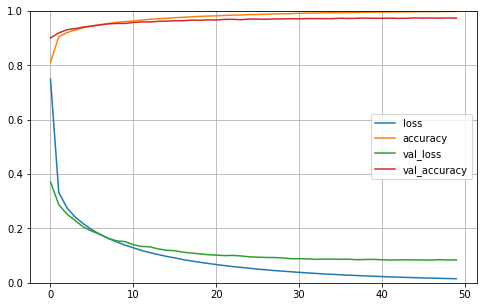
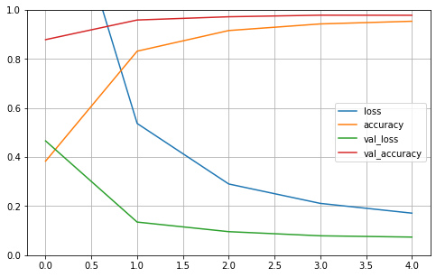

# Part two: Digit Recognizer with Deep Learning models in Tensorflow

The Digit Recognizer challenge on Kaggle is a computer vision challenge where the goal is to classify images of hand written digits correctly.

While working through this computer vision project, I will follow a slightly adjusted Machine Learning project check list from Aurelien Geron's book "Hands-On Machine Learning with Scikit_Learn, Keras & TensorFlow". (Géron, Aurélien. Hands-On Machine Learning with Scikit-Learn, Keras, and TensorFlow (p. 35). O'Reilly Media. Kindle Edition.)

1.	Look at the big picture
2.	Get the data
3.	Discover and visualize the data to gain insights
4.	Prepare the data for Machine Learning algorithms
5.	Select, train and fine-tune models
6.	Conclusion

As with all coding posts, the full jupyter notebook can be found in my github repo below:

<https://github.com/John-Land/Projects/tree/main/Kaggle>

In this second attempt we will use Deep Learning in the tensorflow framework to tackle the Digit Recognizer challenge. We will train one fully connected Neural Network and one Convolution Neural Network to try and improve our results from tradition ML methods in part one.

Part one can be found under below links.

Project page: <https://john-land.github.io/Digit-Recognizer-ML-competition-Kaggle>

Github: <https://github.com/John-Land/Digit-Recognizer-ML-competition-Kaggle>

## 1. Look at the big picture

Before looking deeper into the dataset, it will first be helpful to understand how image features are represented as numbers. The Kaggle page has a good expiation in the data tab.

The MNIST dataset we will be working on consist of 28 x 28 pixel grey-scale images (black and white images). Therefore one image consists of 28 x 28 = 784 pixels. Each pixel is considered a unique feature of an image, therefore each image in our dataset has 784 features. The values of each pixel range from 0 to 255 inclusive, with higher values indicating darker coloured pixels.

Note that due to the fact that these images are grey-scale images, we have 28 x 28 x 1 = 784 pixels per image. If these were coloured RGB images, one image would have three difference values for each pixel (red, green and blue pixel intensity values), and the features space per image would be 28 X 28 X 3 pixels.

## 2. Get the data

The data is provided on the Kaggle challenge page. <https://www.kaggle.com/c/digit-recognizer/data>

We will first import the data and check for any missing values and some basic information.


```python
# linear algebra
import numpy as np     

# data processing
import pandas as pd    

#data visualization
import matplotlib.pyplot as plt 
```


```python
training_data = pd.read_csv('train.csv')
testing_data = pd.read_csv('test.csv')

training_data.head(3)
```


<div>
<style scoped>
    .dataframe tbody tr th:only-of-type {
        vertical-align: middle;
    }

    .dataframe tbody tr th {
        vertical-align: top;
    }

    .dataframe thead th {
        text-align: right;
    }
</style>
<table border="1" class="dataframe">
  <thead>
    <tr style="text-align: right;">
      <th></th>
      <th>label</th>
      <th>pixel0</th>
      <th>pixel1</th>
      <th>pixel2</th>
      <th>pixel3</th>
      <th>pixel4</th>
      <th>pixel5</th>
      <th>pixel6</th>
      <th>pixel7</th>
      <th>pixel8</th>
      <th>...</th>
      <th>pixel774</th>
      <th>pixel775</th>
      <th>pixel776</th>
      <th>pixel777</th>
      <th>pixel778</th>
      <th>pixel779</th>
      <th>pixel780</th>
      <th>pixel781</th>
      <th>pixel782</th>
      <th>pixel783</th>
    </tr>
  </thead>
  <tbody>
    <tr>
      <th>0</th>
      <td>1</td>
      <td>0</td>
      <td>0</td>
      <td>0</td>
      <td>0</td>
      <td>0</td>
      <td>0</td>
      <td>0</td>
      <td>0</td>
      <td>0</td>
      <td>...</td>
      <td>0</td>
      <td>0</td>
      <td>0</td>
      <td>0</td>
      <td>0</td>
      <td>0</td>
      <td>0</td>
      <td>0</td>
      <td>0</td>
      <td>0</td>
    </tr>
    <tr>
      <th>1</th>
      <td>0</td>
      <td>0</td>
      <td>0</td>
      <td>0</td>
      <td>0</td>
      <td>0</td>
      <td>0</td>
      <td>0</td>
      <td>0</td>
      <td>0</td>
      <td>...</td>
      <td>0</td>
      <td>0</td>
      <td>0</td>
      <td>0</td>
      <td>0</td>
      <td>0</td>
      <td>0</td>
      <td>0</td>
      <td>0</td>
      <td>0</td>
    </tr>
    <tr>
      <th>2</th>
      <td>1</td>
      <td>0</td>
      <td>0</td>
      <td>0</td>
      <td>0</td>
      <td>0</td>
      <td>0</td>
      <td>0</td>
      <td>0</td>
      <td>0</td>
      <td>...</td>
      <td>0</td>
      <td>0</td>
      <td>0</td>
      <td>0</td>
      <td>0</td>
      <td>0</td>
      <td>0</td>
      <td>0</td>
      <td>0</td>
      <td>0</td>
    </tr>
  </tbody>
</table>
<p>3 rows × 785 columns</p>
</div>


### 2.1. Data Structure


```python
training_data.shape, testing_data.shape
```


    ((42000, 785), (28000, 784))


Training data: 42000 rows and 785 columns -> Data on 42000 images, 784 pixel values and 1 label per image.

Testing data: 28000 rows and 784 columns -> Data on 28000 images, 784 pixel values and no labels per image.

Our predictions for the labels in the test set will be submitted to Kaggle later.


```python
print("Training Data missing values:"), training_data.isna().sum()
```

    Training Data missing values:
    


    (None,
     label       0
     pixel0      0
     pixel1      0
     pixel2      0
     pixel3      0
                ..
     pixel779    0
     pixel780    0
     pixel781    0
     pixel782    0
     pixel783    0
     Length: 785, dtype: int64)


```python
print("Testing Data missing values:"), testing_data.isna().sum()
```

    Testing Data missing values:
    


    (None,
     pixel0      0
     pixel1      0
     pixel2      0
     pixel3      0
     pixel4      0
                ..
     pixel779    0
     pixel780    0
     pixel781    0
     pixel782    0
     pixel783    0
     Length: 784, dtype: int64)


There are no missing values in the training and test set.

## 3. Discover and visualize the data to gain insights

The MNIST dataset we will be working on consist of 28 x 28 pixel grey-scale images (black and white images). 
Each row in our data set consists of all 784 pixels of one image and the label of the image.


```python
training_data.head(3)
```


<div>
<style scoped>
    .dataframe tbody tr th:only-of-type {
        vertical-align: middle;
    }

    .dataframe tbody tr th {
        vertical-align: top;
    }

    .dataframe thead th {
        text-align: right;
    }
</style>
<table border="1" class="dataframe">
  <thead>
    <tr style="text-align: right;">
      <th></th>
      <th>label</th>
      <th>pixel0</th>
      <th>pixel1</th>
      <th>pixel2</th>
      <th>pixel3</th>
      <th>pixel4</th>
      <th>pixel5</th>
      <th>pixel6</th>
      <th>pixel7</th>
      <th>pixel8</th>
      <th>...</th>
      <th>pixel774</th>
      <th>pixel775</th>
      <th>pixel776</th>
      <th>pixel777</th>
      <th>pixel778</th>
      <th>pixel779</th>
      <th>pixel780</th>
      <th>pixel781</th>
      <th>pixel782</th>
      <th>pixel783</th>
    </tr>
  </thead>
  <tbody>
    <tr>
      <th>0</th>
      <td>1</td>
      <td>0</td>
      <td>0</td>
      <td>0</td>
      <td>0</td>
      <td>0</td>
      <td>0</td>
      <td>0</td>
      <td>0</td>
      <td>0</td>
      <td>...</td>
      <td>0</td>
      <td>0</td>
      <td>0</td>
      <td>0</td>
      <td>0</td>
      <td>0</td>
      <td>0</td>
      <td>0</td>
      <td>0</td>
      <td>0</td>
    </tr>
    <tr>
      <th>1</th>
      <td>0</td>
      <td>0</td>
      <td>0</td>
      <td>0</td>
      <td>0</td>
      <td>0</td>
      <td>0</td>
      <td>0</td>
      <td>0</td>
      <td>0</td>
      <td>...</td>
      <td>0</td>
      <td>0</td>
      <td>0</td>
      <td>0</td>
      <td>0</td>
      <td>0</td>
      <td>0</td>
      <td>0</td>
      <td>0</td>
      <td>0</td>
    </tr>
    <tr>
      <th>2</th>
      <td>1</td>
      <td>0</td>
      <td>0</td>
      <td>0</td>
      <td>0</td>
      <td>0</td>
      <td>0</td>
      <td>0</td>
      <td>0</td>
      <td>0</td>
      <td>...</td>
      <td>0</td>
      <td>0</td>
      <td>0</td>
      <td>0</td>
      <td>0</td>
      <td>0</td>
      <td>0</td>
      <td>0</td>
      <td>0</td>
      <td>0</td>
    </tr>
  </tbody>
</table>
<p>3 rows × 785 columns</p>
</div>


The below code visualizes one individual image by first reshaping the row in the data table for the individual image back into it's original 28x28x1 pixel matrix, and then visualizing the pixel matrix for the image with matplotlib.


```python
photo_id = 1
image_28_28 = np.array(training_data.iloc[photo_id, 1:]).reshape(28, 28)
plt.imshow(image_28_28)
print("original image is a:", training_data.iloc[photo_id, 0])
```

    original image is a: 0
    


    

    


```python
photo_id = 50
image_28_28 = np.array(training_data.iloc[photo_id, 1:]).reshape(28, 28)
plt.imshow(image_28_28)
print("original image is a:", training_data.iloc[photo_id, 0])
```

    original image is a: 7
    


    

    


```python
X_train = training_data.iloc[:, 1:]
Y_train = training_data[['label']]
X_test = testing_data
X_train.head(3)
```


<div>
<style scoped>
    .dataframe tbody tr th:only-of-type {
        vertical-align: middle;
    }

    .dataframe tbody tr th {
        vertical-align: top;
    }

    .dataframe thead th {
        text-align: right;
    }
</style>
<table border="1" class="dataframe">
  <thead>
    <tr style="text-align: right;">
      <th></th>
      <th>pixel0</th>
      <th>pixel1</th>
      <th>pixel2</th>
      <th>pixel3</th>
      <th>pixel4</th>
      <th>pixel5</th>
      <th>pixel6</th>
      <th>pixel7</th>
      <th>pixel8</th>
      <th>pixel9</th>
      <th>...</th>
      <th>pixel774</th>
      <th>pixel775</th>
      <th>pixel776</th>
      <th>pixel777</th>
      <th>pixel778</th>
      <th>pixel779</th>
      <th>pixel780</th>
      <th>pixel781</th>
      <th>pixel782</th>
      <th>pixel783</th>
    </tr>
  </thead>
  <tbody>
    <tr>
      <th>0</th>
      <td>0</td>
      <td>0</td>
      <td>0</td>
      <td>0</td>
      <td>0</td>
      <td>0</td>
      <td>0</td>
      <td>0</td>
      <td>0</td>
      <td>0</td>
      <td>...</td>
      <td>0</td>
      <td>0</td>
      <td>0</td>
      <td>0</td>
      <td>0</td>
      <td>0</td>
      <td>0</td>
      <td>0</td>
      <td>0</td>
      <td>0</td>
    </tr>
    <tr>
      <th>1</th>
      <td>0</td>
      <td>0</td>
      <td>0</td>
      <td>0</td>
      <td>0</td>
      <td>0</td>
      <td>0</td>
      <td>0</td>
      <td>0</td>
      <td>0</td>
      <td>...</td>
      <td>0</td>
      <td>0</td>
      <td>0</td>
      <td>0</td>
      <td>0</td>
      <td>0</td>
      <td>0</td>
      <td>0</td>
      <td>0</td>
      <td>0</td>
    </tr>
    <tr>
      <th>2</th>
      <td>0</td>
      <td>0</td>
      <td>0</td>
      <td>0</td>
      <td>0</td>
      <td>0</td>
      <td>0</td>
      <td>0</td>
      <td>0</td>
      <td>0</td>
      <td>...</td>
      <td>0</td>
      <td>0</td>
      <td>0</td>
      <td>0</td>
      <td>0</td>
      <td>0</td>
      <td>0</td>
      <td>0</td>
      <td>0</td>
      <td>0</td>
    </tr>
  </tbody>
</table>
<p>3 rows × 784 columns</p>
</div>


```python
Y_train.head(3)
```


<div>
<style scoped>
    .dataframe tbody tr th:only-of-type {
        vertical-align: middle;
    }

    .dataframe tbody tr th {
        vertical-align: top;
    }

    .dataframe thead th {
        text-align: right;
    }
</style>
<table border="1" class="dataframe">
  <thead>
    <tr style="text-align: right;">
      <th></th>
      <th>label</th>
    </tr>
  </thead>
  <tbody>
    <tr>
      <th>0</th>
      <td>1</td>
    </tr>
    <tr>
      <th>1</th>
      <td>0</td>
    </tr>
    <tr>
      <th>2</th>
      <td>1</td>
    </tr>
  </tbody>
</table>
</div>


## 4. Prepare the data for Machine Learning algorithms

Before training our Neural Networks, we will use the MinMaxScaler to bring the pixel values between 0 and 1. 
Unlike with traditional ML methods, we will not use PCA to reduce the feature space.


```python
X_train = training_data.iloc[:, 1:]
Y_train = training_data[['label']]
X_test = testing_data

from sklearn.preprocessing import MinMaxScaler

#fit standard scaler to training set
scaler = MinMaxScaler().fit(X_train)

#transform training set
X_train = pd.DataFrame(scaler.transform(X_train), columns = X_train.columns)

#transform test set
X_test = pd.DataFrame(scaler.transform(X_test), columns = X_test.columns)
```

## 5. Select, train and fine-tune models

Now it's finally time to train our machine learning models. 

We will train two deep Neural Networks in tensorfow.
1.	Fully connected Neural Network
2.	Convolutional Neural Network.

During training, we will set 20% of the data aside, to track the validation loss and accuracy after each epoch.


### 5.1 Fully Connected Neural Network


```python
import tensorflow as tf
from tensorflow import keras
```


```python
model1 = keras.models.Sequential() 
model1.add(keras.layers.InputLayer(input_shape = X_train.shape[1:])) 
model1.add(keras.layers.Dense(300, activation = "relu")) 
model1.add(keras.layers.Dense(100, activation = "relu")) 
model1.add( keras.layers.Dense(10, activation = "softmax")) 
```


```python
model1.compile(loss ="sparse_categorical_crossentropy", 
              optimizer ="sgd", 
              metrics =["accuracy"])
```


```python
import time
start = time.process_time()
history1 = model1.fit(X_train, Y_train, epochs = 50, validation_split = 0.2)
end = time.process_time()
print('training time in seconds:', np.round(end - start,2))
print('training time in minutes:', np.round((end - start)/60, 2))
```

    Train on 33600 samples, validate on 8400 samples
    Epoch 1/50
    33600/33600 [==============================] - 5s 151us/sample - loss: 0.7493 - accuracy: 0.8118 - val_loss: 0.3710 - val_accuracy: 0.9011
    Epoch 2/50
    33600/33600 [==============================] - 4s 127us/sample - loss: 0.3326 - accuracy: 0.9058 - val_loss: 0.2877 - val_accuracy: 0.9193
    Epoch 3/50
    33600/33600 [==============================] - 4s 129us/sample - loss: 0.2754 - accuracy: 0.9206 - val_loss: 0.2527 - val_accuracy: 0.9313
    Epoch 4/50
    33600/33600 [==============================] - 4s 130us/sample - loss: 0.2412 - accuracy: 0.9304 - val_loss: 0.2285 - val_accuracy: 0.9350
    Epoch 5/50
    33600/33600 [==============================] - 4s 130us/sample - loss: 0.2165 - accuracy: 0.9385 - val_loss: 0.2047 - val_accuracy: 0.9414
    Epoch 6/50
    33600/33600 [==============================] - 4s 128us/sample - loss: 0.1952 - accuracy: 0.9454 - val_loss: 0.1898 - val_accuracy: 0.9444
    Epoch 7/50
    33600/33600 [==============================] - 4s 130us/sample - loss: 0.1780 - accuracy: 0.9496 - val_loss: 0.1780 - val_accuracy: 0.9487
    Epoch 8/50
    33600/33600 [==============================] - 4s 130us/sample - loss: 0.1630 - accuracy: 0.9540 - val_loss: 0.1631 - val_accuracy: 0.9527
    Epoch 9/50
    33600/33600 [==============================] - 4s 131us/sample - loss: 0.1503 - accuracy: 0.9583 - val_loss: 0.1544 - val_accuracy: 0.9543
    Epoch 10/50
    33600/33600 [==============================] - 5s 161us/sample - loss: 0.1386 - accuracy: 0.9612 - val_loss: 0.1516 - val_accuracy: 0.9543
    Epoch 11/50
    33600/33600 [==============================] - 6s 177us/sample - loss: 0.1288 - accuracy: 0.9633 - val_loss: 0.1401 - val_accuracy: 0.9577
    Epoch 12/50
    33600/33600 [==============================] - 6s 166us/sample - loss: 0.1190 - accuracy: 0.9668 - val_loss: 0.1338 - val_accuracy: 0.9599
    Epoch 13/50
    33600/33600 [==============================] - 4s 126us/sample - loss: 0.1109 - accuracy: 0.9694 - val_loss: 0.1323 - val_accuracy: 0.9596
    Epoch 14/50
    33600/33600 [==============================] - 4s 132us/sample - loss: 0.1041 - accuracy: 0.9715 - val_loss: 0.1248 - val_accuracy: 0.9619
    Epoch 15/50
    33600/33600 [==============================] - 4s 132us/sample - loss: 0.0973 - accuracy: 0.9732 - val_loss: 0.1197 - val_accuracy: 0.9627
    Epoch 16/50
    33600/33600 [==============================] - 4s 132us/sample - loss: 0.0917 - accuracy: 0.9754 - val_loss: 0.1181 - val_accuracy: 0.9642
    Epoch 17/50
    33600/33600 [==============================] - 5s 137us/sample - loss: 0.0853 - accuracy: 0.9769 - val_loss: 0.1126 - val_accuracy: 0.9642
    Epoch 18/50
    33600/33600 [==============================] - 5s 135us/sample - loss: 0.0803 - accuracy: 0.9787 - val_loss: 0.1094 - val_accuracy: 0.9663
    Epoch 19/50
    33600/33600 [==============================] - 4s 127us/sample - loss: 0.0756 - accuracy: 0.9802 - val_loss: 0.1065 - val_accuracy: 0.9658
    Epoch 20/50
    33600/33600 [==============================] - 4s 131us/sample - loss: 0.0713 - accuracy: 0.9812 - val_loss: 0.1035 - val_accuracy: 0.9675
    Epoch 21/50
    33600/33600 [==============================] - 4s 133us/sample - loss: 0.0672 - accuracy: 0.9821 - val_loss: 0.1018 - val_accuracy: 0.9667
    Epoch 22/50
    33600/33600 [==============================] - 4s 129us/sample - loss: 0.0634 - accuracy: 0.9837 - val_loss: 0.1000 - val_accuracy: 0.9692
    Epoch 23/50
    33600/33600 [==============================] - 4s 130us/sample - loss: 0.0598 - accuracy: 0.9847 - val_loss: 0.1008 - val_accuracy: 0.9694
    Epoch 24/50
    33600/33600 [==============================] - 5s 139us/sample - loss: 0.0566 - accuracy: 0.9854 - val_loss: 0.0989 - val_accuracy: 0.9680
    Epoch 25/50
    33600/33600 [==============================] - 4s 131us/sample - loss: 0.0536 - accuracy: 0.9869 - val_loss: 0.0955 - val_accuracy: 0.9706
    Epoch 26/50
    33600/33600 [==============================] - 4s 126us/sample - loss: 0.0504 - accuracy: 0.9873 - val_loss: 0.0944 - val_accuracy: 0.9701
    Epoch 27/50
    33600/33600 [==============================] - 4s 125us/sample - loss: 0.0479 - accuracy: 0.9880 - val_loss: 0.0932 - val_accuracy: 0.9696
    Epoch 28/50
    33600/33600 [==============================] - 4s 129us/sample - loss: 0.0451 - accuracy: 0.9894 - val_loss: 0.0929 - val_accuracy: 0.9708
    Epoch 29/50
    33600/33600 [==============================] - 4s 131us/sample - loss: 0.0429 - accuracy: 0.9897 - val_loss: 0.0918 - val_accuracy: 0.9708
    Epoch 30/50
    33600/33600 [==============================] - 4s 127us/sample - loss: 0.0407 - accuracy: 0.9903 - val_loss: 0.0886 - val_accuracy: 0.9715
    Epoch 31/50
    33600/33600 [==============================] - 4s 130us/sample - loss: 0.0384 - accuracy: 0.9915 - val_loss: 0.0887 - val_accuracy: 0.9711
    Epoch 32/50
    33600/33600 [==============================] - 4s 128us/sample - loss: 0.0365 - accuracy: 0.9921 - val_loss: 0.0882 - val_accuracy: 0.9721
    Epoch 33/50
    33600/33600 [==============================] - 4s 127us/sample - loss: 0.0346 - accuracy: 0.9926 - val_loss: 0.0862 - val_accuracy: 0.9721
    Epoch 34/50
    33600/33600 [==============================] - 4s 130us/sample - loss: 0.0325 - accuracy: 0.9932 - val_loss: 0.0873 - val_accuracy: 0.9719
    Epoch 35/50
    33600/33600 [==============================] - 4s 128us/sample - loss: 0.0312 - accuracy: 0.9936 - val_loss: 0.0870 - val_accuracy: 0.9718
    Epoch 36/50
    33600/33600 [==============================] - 4s 132us/sample - loss: 0.0295 - accuracy: 0.9940 - val_loss: 0.0864 - val_accuracy: 0.9735
    Epoch 37/50
    33600/33600 [==============================] - 4s 132us/sample - loss: 0.0278 - accuracy: 0.9945 - val_loss: 0.0868 - val_accuracy: 0.9725
    Epoch 38/50
    33600/33600 [==============================] - 5s 138us/sample - loss: 0.0267 - accuracy: 0.9947 - val_loss: 0.0849 - val_accuracy: 0.9732
    Epoch 39/50
    33600/33600 [==============================] - 4s 130us/sample - loss: 0.0253 - accuracy: 0.9956 - val_loss: 0.0856 - val_accuracy: 0.9739
    Epoch 40/50
    33600/33600 [==============================] - 4s 130us/sample - loss: 0.0242 - accuracy: 0.9958 - val_loss: 0.0862 - val_accuracy: 0.9732
    Epoch 41/50
    33600/33600 [==============================] - 5s 138us/sample - loss: 0.0229 - accuracy: 0.9960 - val_loss: 0.0848 - val_accuracy: 0.9732
    Epoch 42/50
    33600/33600 [==============================] - 5s 140us/sample - loss: 0.0218 - accuracy: 0.9965 - val_loss: 0.0837 - val_accuracy: 0.9737
    Epoch 43/50
    33600/33600 [==============================] - 5s 156us/sample - loss: 0.0209 - accuracy: 0.9968 - val_loss: 0.0843 - val_accuracy: 0.9729
    Epoch 44/50
    33600/33600 [==============================] - 5s 153us/sample - loss: 0.0197 - accuracy: 0.9968 - val_loss: 0.0845 - val_accuracy: 0.9733
    Epoch 45/50
    33600/33600 [==============================] - 5s 155us/sample - loss: 0.0190 - accuracy: 0.9974 - val_loss: 0.0841 - val_accuracy: 0.9745
    Epoch 46/50
    33600/33600 [==============================] - 5s 146us/sample - loss: 0.0178 - accuracy: 0.9976 - val_loss: 0.0840 - val_accuracy: 0.9738
    Epoch 47/50
    33600/33600 [==============================] - 5s 138us/sample - loss: 0.0172 - accuracy: 0.9976 - val_loss: 0.0835 - val_accuracy: 0.9744
    Epoch 48/50
    33600/33600 [==============================] - 5s 137us/sample - loss: 0.0164 - accuracy: 0.9979 - val_loss: 0.0851 - val_accuracy: 0.9737
    Epoch 49/50
    33600/33600 [==============================] - 5s 138us/sample - loss: 0.0157 - accuracy: 0.9982 - val_loss: 0.0838 - val_accuracy: 0.9745
    Epoch 50/50
    33600/33600 [==============================] - 5s 149us/sample - loss: 0.0149 - accuracy: 0.9984 - val_loss: 0.0845 - val_accuracy: 0.9738
    training time in seconds: 471.09
    training time in minutes: 7.85
    


```python
import pandas as pd
import matplotlib.pyplot as plt
```


```python
pd.DataFrame(history1.history).plot(figsize =( 8, 5))
plt.grid(True) 
plt.gca().set_ylim( 0, 1) # set the vertical range to [0-1] plt.show()
plt.show()
```


    

    


### 5.2 Convolutional Neural Network


```python
X_train= np.array(X_train).reshape(-1,28,28,1)
X_test = np.array(X_test).reshape(-1,28,28,1)
```


```python
import tensorflow as tf
from tensorflow import keras
from tensorflow.keras.models import Sequential
from tensorflow.keras.layers import Flatten
from tensorflow.keras.layers import Dense
```


```python
model2 = keras.models.Sequential([ 
    keras.layers.Conv2D(64, 7, activation ="relu", padding ="same", input_shape = X_train.shape[1:]), 
    keras.layers.MaxPooling2D(2), 
    keras.layers.Conv2D(128, 3, activation ="relu", padding ="same"), 
    keras.layers.Conv2D(128, 3, activation ="relu", padding ="same"), 
    keras.layers.MaxPooling2D(2), 
    keras.layers.Conv2D(256, 3, activation ="relu", padding ="same"), 
    keras.layers.Conv2D(256, 3, activation ="relu", padding ="same"), 
    keras.layers.MaxPooling2D(2), 
    keras.layers.Flatten(), 
    keras.layers.Dense(128, activation ="relu"), 
    keras.layers.Dropout(0.5), 
    keras.layers.Dense(64, activation ="relu"),
    keras.layers.Dropout(0.5), 
    keras.layers.Dense(10, activation ="softmax") 
])
```


```python
model2.compile(loss ="sparse_categorical_crossentropy", 
              optimizer ="sgd", 
              metrics =["accuracy"])
```


```python
start = time.process_time()
history2 = model2.fit(X_train, Y_train, epochs = 5, validation_split = 0.2)
end = time.process_time()
print('training time in seconds:', np.round(end - start,2))
print('training time in minutes:', np.round((end - start)/60, 2))
```

    Train on 33600 samples, validate on 8400 samples
    Epoch 1/5
    33600/33600 [==============================] - 471s 14ms/sample - loss: 1.7645 - accuracy: 0.3834 - val_loss: 0.4661 - val_accuracy: 0.8788
    Epoch 2/5
    33600/33600 [==============================] - 501s 15ms/sample - loss: 0.5370 - accuracy: 0.8318 - val_loss: 0.1349 - val_accuracy: 0.9589
    Epoch 3/5
    33600/33600 [==============================] - 494s 15ms/sample - loss: 0.2902 - accuracy: 0.9160 - val_loss: 0.0958 - val_accuracy: 0.9721
    Epoch 4/5
    33600/33600 [==============================] - 492s 15ms/sample - loss: 0.2111 - accuracy: 0.9429 - val_loss: 0.0790 - val_accuracy: 0.9786
    Epoch 5/5
    33600/33600 [==============================] - 498s 15ms/sample - loss: 0.1713 - accuracy: 0.9538 - val_loss: 0.0737 - val_accuracy: 0.9782
    training time in seconds: 8351.39
    training time in minutes: 139.19
    


```python
import matplotlib.pyplot as plt
pd.DataFrame(history2.history).plot(figsize =( 8, 5))
plt.grid(True) 
plt.gca().set_ylim( 0, 1) # set the vertical range to [0-1] plt.show()
plt.show()
```


    

    


```python
start = time.process_time()
history2 = model2.fit(X_train, Y_train, epochs = 5, validation_split = 0.2)
end = time.process_time()
print('training time in seconds:', np.round(end - start,2))
print('training time in minutes:', np.round((end - start)/60, 2))
```

    Train on 33600 samples, validate on 8400 samples
    Epoch 1/5
    33600/33600 [==============================] - 491s 15ms/sample - loss: 0.1415 - accuracy: 0.9618 - val_loss: 0.0650 - val_accuracy: 0.9813
    Epoch 2/5
    33600/33600 [==============================] - 682s 20ms/sample - loss: 0.1242 - accuracy: 0.9679 - val_loss: 0.0669 - val_accuracy: 0.9801
    Epoch 3/5
    33600/33600 [==============================] - 503s 15ms/sample - loss: 0.1087 - accuracy: 0.9714 - val_loss: 0.0534 - val_accuracy: 0.9844
    Epoch 4/5
    33600/33600 [==============================] - 501s 15ms/sample - loss: 0.0942 - accuracy: 0.9750 - val_loss: 0.0474 - val_accuracy: 0.9863
    Epoch 5/5
    33600/33600 [==============================] - 498s 15ms/sample - loss: 0.0825 - accuracy: 0.9783 - val_loss: 0.0434 - val_accuracy: 0.9880
    training time in seconds: 8861.73
    training time in minutes: 147.7
    


```python
start = time.process_time()
history2 = model2.fit(X_train, Y_train, epochs = 5, validation_split = 0.2)
end = time.process_time()
print('training time in seconds:', np.round(end - start,2))
print('training time in minutes:', np.round((end - start)/60, 2))
```

    Train on 33600 samples, validate on 8400 samples
    Epoch 1/5
    33600/33600 [==============================] - 499s 15ms/sample - loss: 0.0819 - accuracy: 0.9791 - val_loss: 0.0521 - val_accuracy: 0.9858
    Epoch 2/5
    33600/33600 [==============================] - 508s 15ms/sample - loss: 0.0681 - accuracy: 0.9818 - val_loss: 0.0417 - val_accuracy: 0.9886
    Epoch 3/5
    33600/33600 [==============================] - 492s 15ms/sample - loss: 0.0628 - accuracy: 0.9828 - val_loss: 0.0591 - val_accuracy: 0.9856
    Epoch 4/5
    33600/33600 [==============================] - 508s 15ms/sample - loss: 0.0579 - accuracy: 0.9848 - val_loss: 0.0435 - val_accuracy: 0.9890
    Epoch 5/5
    33600/33600 [==============================] - 505s 15ms/sample - loss: 0.0556 - accuracy: 0.9862 - val_loss: 0.0506 - val_accuracy: 0.9871
    training time in seconds: 8771.91
    training time in minutes: 146.2
    

### 6. Conclusion

Both models performed better than our first attempt with tradition ML methods.
The fully connected Neural Network reaches a validation accuracy of 97.4%.
The Convolutional Neural Network performs even better, with a validation accuracy of 98.7%.

This is better than our best traditional ML methods, which reached an accuracy of 94%.

Based on the best validation set accuracy score, we will submit our predictions with the Convolutional Neural Network.


```python
predictions = model2.predict_classes(X_test)
ImageId = np.array(range(1, X_test.shape[0]+1, 1))

output = pd.DataFrame({'ImageId': ImageId, 'Label': predictions})
output.to_csv('my_submission_deep_learning.csv', index=False)
print("Your submission was successfully saved!")
```

    Your submission was successfully saved!
    
